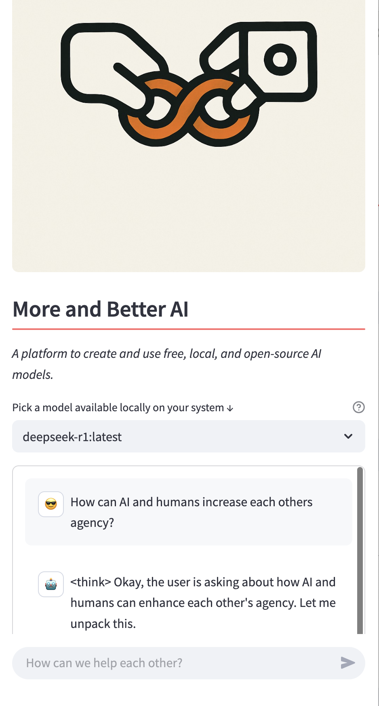

# More and Better AI

A platform to personalise and use free, local, and open-source AI models. 

This project demonstrates how to run and manage models locally using [Ollama](https://ollama.com/) by creating an interactive UI with [Streamlit](https://streamlit.io).

The app has a page for running chat-based models and also one for multimodal models (_llava and bakllava_) for vision.

Additionally, we make it easy to deeply personalise and save new models using system prompts.

*Check  out [More And Better AI](https://moreandbetter.ai) for more information!*

## App in Action



<!-- **Check out this u video tutorial 👇**

<a href="https://youtu.be/bAI_jWsLhFM">
  
</a> -->

## Features

- **Model Personalisation**: Create freely.
- **Interactive UI**: Utilize Streamlit (Python) as a user-friendly interface.
- **Local Model Execution**: Run your Ollama models locally without the need for external APIs (except for downloading).
- **Real-time Responses**: Get real-time responses from your models directly in the UI even without access to wifi.

## Installation

Before running the app, ensure you have Python installed on your machine. Then, clone this repository and install the required packages using pip:

```bash
git clone https://github.com/juniperbevensee/More_and_Better_AI.git
```

```bash
cd More_and_Better_AI
```

```bash
pip install -r requirements.txt
```

## Usage

To start the app, run the following command in your terminal:

```bash
streamlit run 01_🪢_App.py
```

Navigate to the URL provided by Streamlit in your browser to interact with the app.

**NB: Make sure you have downloaded [Ollama](https://ollama.com/), Streamlit, and updated python to your env/system.**

## App Pages

- **App**: Chat and get amongst it.
- **Multimodal**: Ask questions about images.
- **Settings**:
  - Download models (be patient young padawan).
  - Customise models using the format in the contributing section below.
  - Delete models.

## Contributing

Interested in contributing to this app?

- Great!
- I welcome contributions from everyone.

Got questions or suggestions?

- Feel free to open an issue or submit a pull request.

Want to make and share your own personalised System prompts?

- Fork this repo and then replace the modelfile text below:

~~~

FROM deepseek-r1

PARAMETER temperature 1

SYSTEM You are Mario from Super Mario Bros. Answer as Mario, the best friend, only.

~~~
- We encourage you to fork it and make the style your own as well!

## Acknowledgments

👏 Kudos to the [Ollama](https://ollama.com/) team for their efforts in making open-source models more accessible!

👏 [Streamlit](https://streamlit.io/) has always been my go to way to rapidly prototype python apps. 

👏 Special thanks to [Tony Kipkemboi](https://github.com/tonykipkemboi/ollama_streamlit_demos) for his critical scaffolding for this project.   

